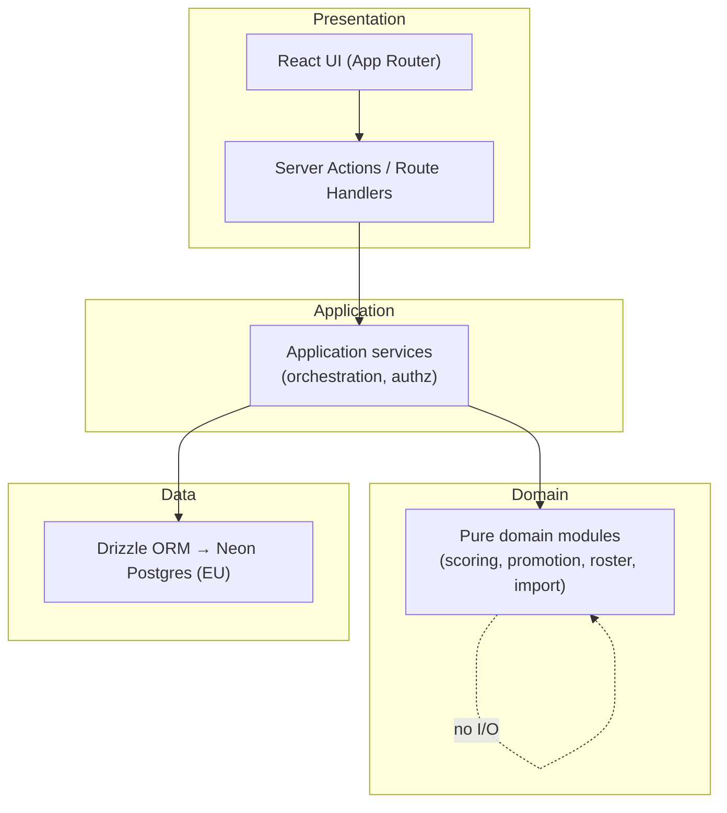
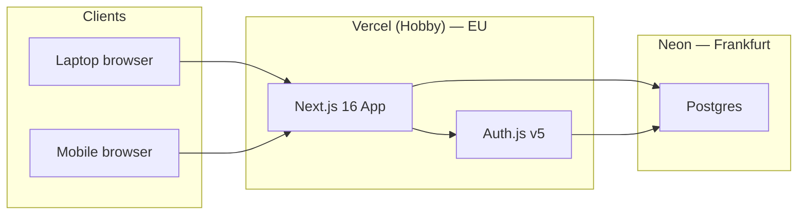

# Architecture Spine — CHAMPIONS Dictation Dashboards

## Design Paradigm

**Layered monolith** on a single Next.js deployable. One codebase, one database, strict internal boundaries:



| Layer | Lives in | May depend on |
| --- | --- | --- |
| Presentation | `app/`, `components/` | Application |
| Application | `lib/services/` | Domain, Data |
| Domain | `lib/domain/` | Nothing (pure) |
| Data | `lib/db/` | Database only |

## Invariants & Rules

### AD-1 — Class-scoped tenancy

- **Binds:** CAP-1, CAP-2, CAP-3, CAP-5, CAP-6, CAP-7; all data access
- **Prevents:** Teacher A reading or mutating Teacher B's roster, dictations, or dossiers
- **Rule:** Every domain entity belongs to exactly one `Class`. Application services resolve the authenticated teacher's class and pass `classId` into every query and mutation. No cross-class reads or writes. Authorization is enforced in application services — not only in UI routing.

### AD-2 — Teacher-owned class, self-registration

- **Binds:** CAP-3; auth and onboarding
- **Prevents:** Admin-provisioned accounts, shared teacher logins, or classes without an owning teacher
- **Rule:** A `Teacher` account (email + password via Auth.js) self-registers. `Teacher.id` equals the Auth.js `users.id` (1:1, no separate teacher identity). On first login, the teacher creates one `Class` for the current school year. MVP: one class per teacher per school year. No school-wide admin role.

### AD-3 — Server-authoritative mutations

- **Binds:** CAP-1, CAP-3, CAP-4, CAP-5; all writes
- **Prevents:** Client-side-only scoring, promotion side-effects, or roster changes that bypass validation
- **Rule:** All state changes go through Server Actions or route handlers → application services → domain validation → database transaction. The browser never computes authoritative scores, promotion outcomes, or archive status.

### AD-4 — Domain-owned scoring and promotion logic

- **Binds:** CAP-4, CAP-5; `scoring-model.md`, `level-system.md`
- **Prevents:** Duplicated or divergent scoring/promotion rules across grid save, dossier display, and presentation mode
- **Rule:** `lib/domain/scoring` and `lib/domain/promotion` are pure modules implementing spec companions. Application services call them; UI and DB layers do not reimplement formulas or consecutive-dictation thresholds.

### AD-5 — Dictation row snapshots are immutable per save

- **Binds:** CAP-4, CAP-5; `scoring-model.md`, `dictation-lifecycle.md`
- **Prevents:** Historical percentages changing when a student's current level changes later
- **Rule:** On dictation save, persist per-student snapshot fields: `levelAtSave`, `wordDenominator`, `globalPercent`, nine category error counts. Subsequent level changes do not retroactively alter stored snapshots. Editing a past dictation recalculates using the **original** snapshot level/denominator for that row, then re-runs promotion detection forward from that dictation.

### AD-6 — Single pending promotion per student

- **Binds:** CAP-5; `level-system.md`, `ux-decisions.md`
- **Prevents:** Conflicting promotion alerts across banner, queue, grid indicator, and **+** button
- **Rule:** At most one `PendingPromotion` per student (target next level). All surfaces read the same record. First validate/refuse wins (idempotent). Manual level override or validate/refuse clears pending state. Refuse resets the consecutive-dictation streak per `level-system.md`.

### AD-7 — Leveled students only on active grids

- **Binds:** CAP-1, CAP-3, CAP-7; `roster-import.md`, `level-system.md`
- **Prevents:** Unleveled students appearing on dictation grids or receiving scored dictation rows
- **Rule:** Students without an assigned color level are visible on roster/Élèves tab only (with « niveau requis » indicator). Dictation grid and mobile entry include only active, non-archived students with a level. Archived students are excluded from active grids but preserved on historical dictation records.

### AD-8 — EU data residency

- **Binds:** CAP-3; student roster (personal data)
- **Prevents:** Student names and progression data stored outside the EU
- **Rule:** Neon Postgres project region is **AWS EU (Frankfurt)**. Vercel deployment targets EU. No replica or backup region outside EU on free tier without explicit revisit.

### AD-9 — Request/refresh data model (no realtime)

- **Binds:** CAP-1, CAP-6, CAP-7; laptop + mobile concurrent use
- **Prevents:** WebSocket infrastructure, optimistic multi-device sync conflicts, stale-push complexity
- **Rule:** Data is fetched on page load and after successful mutations (revalidate/navigation). No WebSockets or live subscriptions. Concurrent laptop + mobile sessions for the same teacher may show stale data until refresh — acceptable.

### AD-10 — Fixed CHAMPIONS taxonomy

- **Binds:** CAP-1; `error-categories.md`
- **Prevents:** Per-teacher configurable error columns or dynamic category counts
- **Rule:** Nine error categories (C–S) are a compile-time/domain constant. Database schema and grid UI always use this fixed set. Category codes are stable identifiers in code and storage.

### AD-11 — Grade-level agnostic

- **Binds:** CAP-3, CAP-6; UI copy, data model, onboarding
- **Prevents:** Hard-coded school grade (CE2, CM1, etc.) in schema, UI labels, or business rules — blocking use across the two target grade levels
- **Rule:** The app never references or stores a school **grade level** (niveau scolaire). `Class` means a teacher's classroom group for a school year — not a curriculum cycle. No `grade_level` field, enum, or UI copy naming CE2 or any other cycle. CHAMPIONS **color levels** (yellow → gold) are student proficiency bands and remain in scope. Two teachers at different grade levels use the same app instance and feature set.



## Consistency Conventions

| Concern | Convention |
| --- | --- |
| Naming (entities) | `PascalCase` types; DB tables `snake_case` plural (`students`, `dictation_entries`); FK `*_id` |
| Naming (files) | `kebab-case` filenames; domain modules under `lib/domain/` (one file per concern) |
| IDs | UUID v4 for all primary keys |
| Dates | `timestamptz` in DB; ISO 8601 in API boundaries; school-year dates as `date` |
| Level colors | Enum: `yellow`, `green`, `violet`, `gold` — CHAMPIONS student proficiency bands; not school grade |
| School grade | None — no field, enum, or UI copy for niveau scolaire (AD-11) |
| Level history actions | Enum: `assigned`, `promoted`, `refused`, `manual` |
| Error categories | Enum array of 9 codes matching `error-categories.md` (C→S order) |
| Auth errors | Generic message on login failure; no email-exists leak on registration |
| Logging | Server-side only; never log student names in production info logs |
| Config | Secrets via Vercel env vars; `DATABASE_URL`, `AUTH_SECRET` required |

## Stack

| Name | Version |
| --- | --- |
| Node.js | 22 LTS |
| Next.js | 16.3.2 |
| React | 19.x |
| TypeScript | 5.x |
| Auth.js (next-auth) | 5.x |
| @auth/neon-adapter | latest |
| @neondatabase/serverless | latest |
| Drizzle ORM | latest |
| drizzle-kit | latest |
| bcryptjs | latest |
| Vercel (Hobby) | current |
| Neon Postgres (Frankfurt) | current free tier |

## Structural Seed

```mermaid
erDiagram
  Teacher ||--o| Class : owns
  Class ||--|{ Student : has
  Class ||--|{ Dictation : has
  Class ||--|{ WordCountMatrixRow : configures
  Student ||--o{ LevelHistoryEntry : tracks
  Student ||--o| PendingPromotion : may_have
  Dictation ||--|{ DictationEntry : contains
  Student ||--o{ DictationEntry : participates
  DictationEntry }o--|| Dictation : for
  DictationEntry }o--|| Student : for

  Teacher {
    uuid id PK
    string email
    string password_hash
  }
  Class {
    uuid id PK
    uuid teacher_id FK
    string school_year_label
  }
  Student {
    uuid id PK
    uuid class_id FK
    string display_name
    enum level nullable
    boolean archived
  }
  Dictation {
    uuid id PK
    uuid class_id FK
    string label
    date dictation_date
  }
  DictationEntry {
    uuid id PK
    uuid dictation_id FK
    uuid student_id FK
    enum level_at_save
    int word_denominator
    int global_percent
    int errors_c through errors_s
  }
  WordCountMatrixRow {
    uuid id PK
    uuid class_id FK
    string dictation_label_key
    int words_yellow green violet gold
  }
  LevelHistoryEntry {
    uuid id PK
    uuid student_id FK
    enum level
    enum action
    timestamptz occurred_at
  }
  PendingPromotion {
    uuid id PK
    uuid student_id FK
    enum target_level
  }
```

```text
champions-app/
  app/
    (auth)/           # login, register
    (dashboard)/      # tabs: élèves, dictées, alertes, config
    api/auth/         # Auth.js handlers
  components/         # UI by feature area
  lib/
    domain/
      scoring.ts      # global %, trend delta
      promotion.ts    # consecutive-dictation detection
      roster-import.ts
      error-categories.ts
    services/         # authz + orchestration per use case
    db/
      schema.ts
      queries/
  drizzle/            # migrations
```

### Deployment & environments

| Environment | App | Database | Purpose |
| --- | --- | --- | --- |
| `production` | Vercel Hobby (main branch) | Neon Frankfurt (main branch) | 2 teachers, live school year |
| `preview` | Vercel preview deploys | Neon branch per preview (optional) | PR review |
| `local` | `next dev` | Neon dev branch or local Postgres | development |

CI: GitHub → Vercel auto-deploy. Migrations via `drizzle-kit push` or migrate in deploy step.

## Capability → Architecture Map

| Capability / Area | Lives in | Governed by |
| --- | --- | --- |
| CAP-1 Class grid entry | `app/(dashboard)/dictations/`, `components/grid/`, `lib/services/dictation-save` | AD-1, AD-3, AD-4, AD-7, AD-10 |
| CAP-2 Student dossier | `app/(dashboard)/students/[id]/`, `lib/services/dossier` | AD-1, AD-4, AD-5 |
| CAP-3 Roster & year config | `app/(dashboard)/config/`, `lib/domain/roster-import`, `lib/services/roster` | AD-1, AD-2, AD-7, AD-8, AD-11 |
| CAP-4 Auto global % | `lib/domain/scoring`, `lib/services/dictation-save` | AD-3, AD-4, AD-5 |
| CAP-5 Level tracking & promotion | `lib/domain/promotion`, `lib/services/level`, promotion UI surfaces | AD-4, AD-5, AD-6 |
| CAP-6 Parent-meeting presentation | `app/(dashboard)/students/[id]/present/` | AD-1, AD-4, AD-9, AD-11 |
| CAP-7 Mobile per-student entry | `app/(dashboard)/dictations/[id]/mobile/` | AD-1, AD-3, AD-7, AD-9 |
| Auth & registration | `app/(auth)/`, Auth.js config | AD-2 |
| Data persistence | Neon Postgres via Drizzle | AD-8 |

## Deferred

| Item | Why it can wait |
| --- | --- |
| Explicit `School` entity | Teachers are isolated by class; "same school" is organizational context only in MVP |
| Multi-class per teacher | MVP targets one classroom group per teacher per school year |
| Row-level security (Postgres RLS) | Application-layer class scoping sufficient at 2-user scale; add if threat model grows |
| Realtime / WebSocket sync | AD-9: refresh model accepted |
| Offline / PWA cache | Explicitly out of scope |
| Dictation delete / purge | Deferred in `mvp-scope.md` |
| Word-count matrix CSV import (F3) | Deferred in `mvp-scope.md` |
| Full mobile class grid | Deferred in `mvp-scope.md` |
| Email verification on signup | Optional hardening; not blocking 2 known teachers |
| Commercial hosting tier | Vercel Hobby non-commercial clause; revisit if school formally adopts |
| Automated GDPR data-export / erasure flows | Manual process acceptable at pilot scale; document in ops when live |
